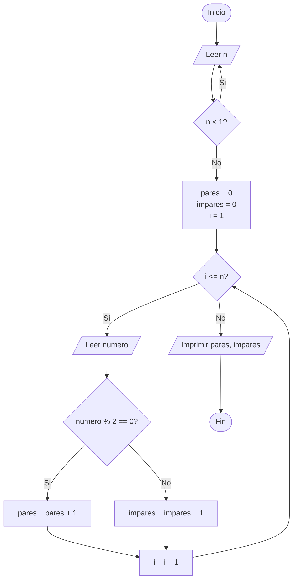

# Ejercicio 39 - Diagrama de flujo

Digitados n numeros, imprimir cuantos son pares y cuantos impares.

```mermaid
flowchart TD
    A([Inicio]) --> B[/Leer n/]
    B --> C{n < 1?}
    C -- Si --> B
    C -- No --> D[pares = 0<br>impares = 0<br>i = 1]
    D --> E{i <= n?}
    E -- Si --> F[/Leer numero/]
    F --> G{numero % 2 == 0?}
    G -- Si --> H[pares = pares + 1]
    G -- No --> I[impares = impares + 1]
    H --> J[i = i + 1]
    I --> J
    J --> E
    E -- No --> K[/Imprimir pares, impares/]
    K --> L([Fin])
```
